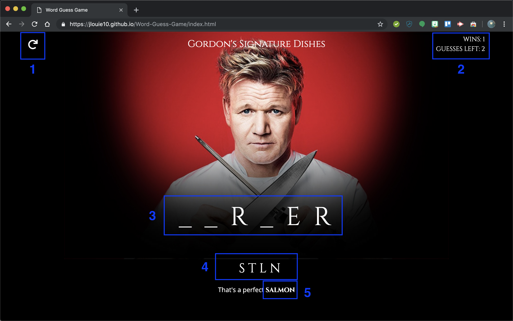

# Word-Guess-Game
A word guessing game based on Gordon Ramsay's signature dishes. Players gets a limited amount of letter guesses. Wins and losses are tracked. 

## Screenshots


1. Reload button that restarts the game
2. Wins and guesses counter
3. Current word
4. Incorrect guessed letters
5. A message from Gordon when a new game starts/game ends

## Features
This game includes 2 difficulties. The default difficulty is 2 (HARD), which contains a wordpack of 50 foods that Gordon serves at his restaurants or teaches in his cookery course. To change the difficulty level to 1 (EASY), which contains a basic wordpack of 5 signature Gordon Ramsay dishes, update the following line in game.js:

```var difficulty = 2; // Set to 1 or 2 (harder)```

## Instructions
Start a new game by loading the page or clicking reload. The window will prompt you to press any key to get started. The prompt goes away after the first letter keystroke, and it will return when the game is reloaded. Only letter keystrokes are allowed, the game will ignore non-letter inputs. 

The number of guesses you receive will be equal to the number of letters in the word. When a correct letter is guessed, it will become unmasked. When an incorrect letter is guessed, it will be displayed at the bottom of the page. Guess the word correctly and receive some praise from Gordon. Guess wrong, and get scolded.

## Help
If you are having trouble guessing the word, the current word is exported to the console for your benefit.

## Backlog
* Organize the game code as objects and functions as methods
* Replace reload link with link to the readme
* Remove the reload link on the .navbar-brand
* Simplify the use of arrays (arrays used to organize current word and guessed letters, but can be reduced by containing everything in strings)
* Add hints, because this is actually hard
* Add animation for Gordon getting angry and happy upon wrong and correct guesses, respectively
* Add sound on successful/unsuccessful guesses
